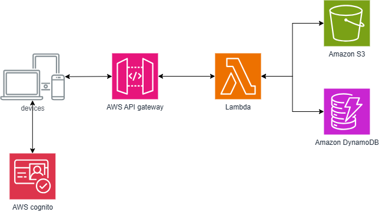

# 👼🏼 My Angel - Mobile Application with AWS integration

## Overview
Daily Angel is a **React Native mobile application** built with **Expo** that helps users getting the answer of the questions they have in mind by using Tarot Card. The app leverages **AWS services** for user authentication, data storage, and secure API calls.

This project demonstrates **full-stack mobile development**, showcasing:
- **React Native & Expo** for cross-platform mobile development.
- **AWS (Cognito, DynamoDB, S3, Lambda, API Gateway)** for backend services.

---

## Tech Stack & AWS Services Used
### 📱**Frontend:**
- **React Native (Expo)** - Mobile app framework.
- **Styled Components** - Custom UI styling.
- **React Navigation** - Smooth user navigation.

### ☁️**Backend (AWS Services):**
- **AWS Cognito** - Secure user authentication.
- **AWS S3** - Storing images and assets.
- **AWS DynamoDB** - NoSQL database for journal entries.
- **AWS Lambda** - Serverless backend functions.
- **AWS API Gateway** - Secure REST API for app communication.

## Features
- **User Authentication:** Secure sign-up, login, and session management via AWS Cognito.
- **Journal Entries:** Users can add and delete personal questions journal entries.  
- **Cloud Storage:** Journal entries are stored in **AWS DynamoDB** and retrieved dynamically.  
- **Serverless Architecture:** Uses **AWS Lambda** for efficient backend operations.  
---

## Architecture Overview

The application follows a **serverless architecture**:
1. **Frontend (React Native Expo)**
   - Handles UI and user interactions.
   - Calls **AWS API Gateway** to perform backend operations.
  
2. **Backend (AWS)**
   - `AWS Cognito` handles user authentication.
   - `AWS Lambda` executes serverless logic.
   - `DynamoDB` stores journal entries.
   - `S3` stores static assets and images.

---

## 🏋️Challenges and  Learnings
- **Serverless Development**: Efficient use of AWS Lambda and API Gateway as backend for cost optimization.
- **React Native Best Practices**: Optimized navigation, state management, and styling for cross-platform app development.
- **Security**: Using AWS Cognito for authentication.

---

## 🤸Future Improvements
- **Deploying a Full Stack App**: Waiting for approval for Apple's developer program,
- **Machine Learning**: Applying for question recognization aims for accurate and customized card result to users.

